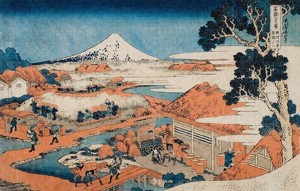
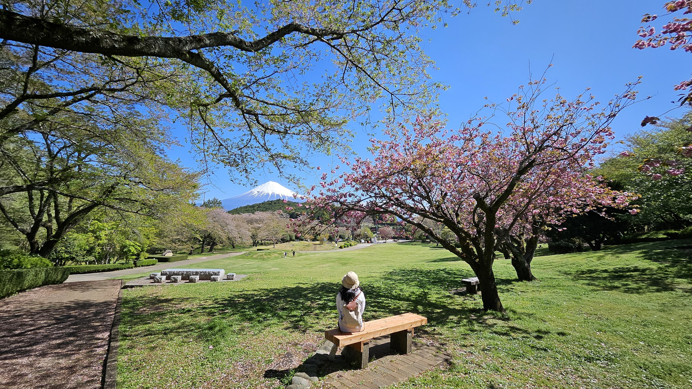
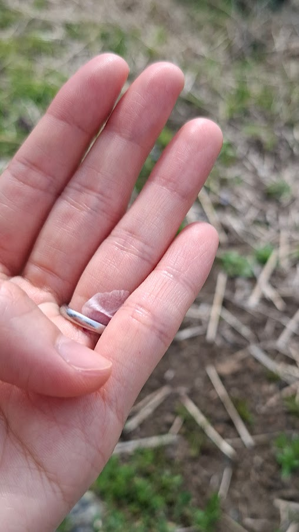
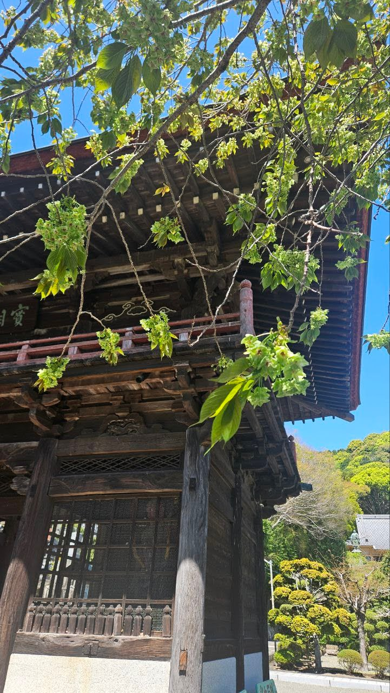
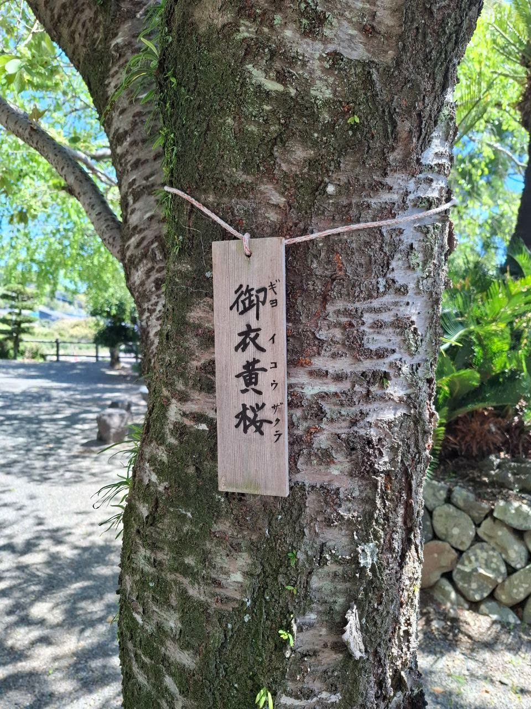
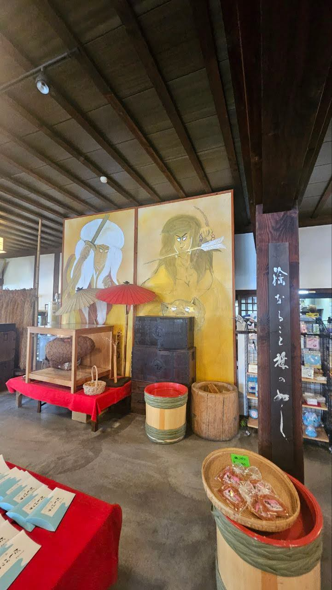

ただいま。
  
我回來了。
回到佗寂的國度、
拾回點寫作的感覺;

逃避房貸和種種紛擾憾事，
逆向思維在異地尋覓居所。

也又再為自己按F5 重新整理，
平平實實，沒打算享受生活，這是生活。

抓緊些甚麼過活，
禮失求諸野，此心安處是吾鄉。

---

安頓於福岡前，
旅程先訪表裏靈峰。

經歷代文藝創作，富士代表日本，
是種集體想像。

太宰治的《富嶽百景》，
開首便說富士山其實沒那麼聳峭，広重和北斎讓大家想多了。

家中我掛了幅《凱風快晴》，不諳美術卻對浮世繪情有獨鍾。
數年前，偶爾讀到的那段引人入勝的美術史：
各種破格的人物、交流演化的故事比畫作本身對我來說更曉有趣味。
梵高沒到過日本，後期卻大受浮世繪影響;
臨摹過歌川廣重，甚至有[《星夜》是受神奈川衝浪啟發的說法](https://www.bbc.com/ukchina/trad/vert-cul-43537936)。
葛飾北斎開創漫畫先河，
畫《富嶽三十六景》，打卡的MEME比我們都早了200年。

  

日本地理知識有限，也總因為信長聽過今川義元和駿河國。
北斎的《駿州片倉茶園之不二》，畫的是今天靜岡県駿河灣富士市。
在郊區漫步，也果然還可見不少茶園。
走進人煙稀少，只存在過去的舊市區，經過一道又一道鐵閘，居然聯想起馬六甲。
長夜漫漫，到訪百年酒造改裝的酒吧，呷口於我過於輕柔的日式威士忌。

富士四時景色各有千秋。
上岩本山公園，
這邊遠眺的山面較柔滑如女生肩膀，靜岡人道此謂女富士。
冠雪還在，櫻花卻不再盛放，遊人疏落，
好珍惜這一點恬靜。

  
當山與花映在你我的瞳孔，
今生今世、一期一會，
提醒我們去細想，要選擇種怎樣的人生。
  

----

登上河口湖新倉富士浅間神社，
暖得晚，漫山遍野的櫻花，
與五重塔和富嶽拼湊出日本風情。
  
那管在網上如何吵鬧，在靖國神社如何撒賴，
新倉山上一樣是人頭湧湧的。
五重塔是忠靈塔，祭的[當然是日軍](https://chureito-pagoda.com/summary/)。

櫻花的美感，就在綻放於生死之間。
大和民族賞櫻由來有久，
平安時代起便成了詩歌詠嘆物哀的題材，
江戶時代到二戰，則是武士道至[特攻隊犠牲的標記](https://zh.wikipedia.org/wiki/MXY-7%E6%AB%BB%E8%8A%B1%E7%89%B9%E5%88%A5%E6%94%BB%E6%93%8A%E6%A9%9F)。

下山的參道捲起櫻吹雪； 
**身隨花落，**
**心卻能隨香漂。**[1]

當思索的不再是年月，而以世代為單位，
真正可擁有的是**甚麼**，
又要**留點甚麼**。

天地悠悠，屹立萬年的富士山下，
古往今來多少變遷。
即使沒有那種萬物有靈的信仰，
人在活火山前也許總要學會點謙卑。
  
刹那無常，
「應該」和「允許」都是多餘的詞彙。
失落，都源於種種期許：
哀傷，總是面對不了世事最現實又最無言的空虚。

做最堅強的泡沫，
那點信念，有還是沒有。

正如《富嶽百景》，
霊峰可美，在看的人的心境。

---
  

河口湖和京都，
今天成了最日本和最不日本的場所。

富士五湖延連過百里，
山梨或静岡每個街頭都像明信片，靈峰遠至東京也能看見。
河口湖車站的便利店，遊人偏要在狹窄的公路邊排隊拍照，
仿佛沒配上最cliché的最膚淺的符號，沒有「儀式感」，沒來過日本。
那邊廂富士吉田本町通拍山下街景，一樣擠出馬路。

日本媒體報導外國人「殺到」，
面斥不雅，掛上黑幕也無法趕退人潮，
倒不如就地設置便所，
體驗太宰治筆下主角從廁所的紗窗張看富士的感受，也許還比較特別。

  
人群那麼像羊群不是新鮮事，
無獨有偶，Nicholas Carr的[《Superbloom》](https://www.nicholascarr.com/?page_id=664)便以此為題：
某年加州州花黃金罌粟盛放，
一片花田引來某KOL放上IG，
萬千仿效做成種種生態災難。
忙碌地求取認同，轉眼只惹來謾罵。

在AI世代前，我們早活在演算法的世界中，追趕分秒計的潮流。
名譽和信用與你我的注意力都被量化，Memecoin 有價有市，帶動每點神經。
看神劇《混沌少年時》，
在網絡前充斥焦慮的，又何止少年。
越要表現自我，越迷失自我，
以為擁有，其實沒有。

作為曾經的[科技觀主義者Techno optimist](https://vitalik.eth.limo/general/2023/11/27/techno_optimism.html)

活在今天快、淺、利益為先的種種封閉平台，各種建構出的真實，
總有不甘，或更多是恐懼；
去中心化或隱私技術成熟，應用卻沒必然性。
嘗試斷絕各種社交媒體，又避不開種種需要，患得患失。

當感激列島裏還有許多未被沾污，停留在歷史的場所，
用最傳統的、最純潔的感覺去抗𧗾現代的失落

在重巒疊嶂的寺祠信步池邊，
抬起頭，睜開眼張開耳，
靜聽蟬聲風聲，
發覺老柏樹倒影著粼粼波光，
一**邊**站只覓食的翠島。
善意的寺人前來問好，還帶你看不起眼卻珍貴的御衣黃櫻。
這種景點沒甚麼社交媒體背書，也無法變成速食式的冥想App，

**那Moment卻不僅最現實，還最Connected。**

---

此行的契機，是參加了富士五湖的超級馬拉松。

住進「選手村」，門口剛好是鄉土料理餺飥名店「不動」。

Carbo-loading成了最佳的藉口。

店名當然源自風林火山中的不動如山：

相傳餺飥傳入日本成了武田信玄的軍中伙食，店中盡是武田家臣晝像。

在甲州山岳之地悟出孫子兵法，

疾如風徐如林，

甲斐之虎知道生死之間，要作出決斷。

在富士山下櫻花樹旁一步一步往前，
大抵是用美景去麻醉痛苦的傳統。
擦身而過的都是挑戰100公里以上的跑者，
許多還年過半百。
村上春樹說跑100公里是種宗教體驗，
我參與的62公里，只能算是合家歡路線。
大和民族尚武又以忍耐為美德，戰後日本成最愛長跑的國家。

跑過精進湖，相傳是往富士山参拜者的斎戒沐浴之所。

精進是佛家語，指克服困難修行正道。

業精於勤，知正見而不修，是為怠。

ファイト (Fight)打氣聲此起彼落，

提醒你**每一刻**都需要面對和耕耘。

越要跑得快走得遠，越需要一份沉實。

長跑最現實，快了慢了終點不變沒有半點藉口。

忠於自己的步速嘗試過，

值得虛心觀察學習、努力磨練的地方還是很多。

----

旅程的中轉站，回到不屬於我的城市;

看那海傍萬點燈光，看那多淒美的境況，

儘管一大部分的我又屬於這裏。

機緣巧合短暫拾遺，

走進十數年前第一份全職工作的那層辦公室，

今天是個共同工作間。

玻璃外盡是連綿山景我竟沒甚麼印象，

不知是過往Cubicle的間格太沒人性，

還是無暇去欣賞。

身邊若有人看見，大概會驚訝我流露出種重返毒氣室的眼神，
  
其實那是小城平凡的工作，也有過窩心的上司同事，

對那些年桀驁不馴的我卻是種面對不了的現實。

  
十數年來，有一如所料的產業職場變化，

卻又不知不覺經歷了某種大時代。

  
在那港島線地鐵還沒有大學站的年代修讀碩士，

每天在午餐僅有的時間趕作業，

開發side project，還爭取時間看點新知。

在地鐵和亡命小巴除了温習講義，還一本一本追看Oreilly的各種技術入門。

 
論文大扺在那咖啡店的椅子完成了。

讀的沒甚麼價值，做出來的也沒甚麼價值，

價值在那點堅持。
 

對社會滿腔失望怨憤，

那些年還會試點改變，即使多不智。

At least he tried. 

他只是想做自己。

---

>曾迷途才怕追不上滿街趕路人

>無人理睬如何求生
  

林夕的詞多年後才能感悟。

若不放下，獨行還是做羊，其實一樣累人
  
  
人大了種種身不由已，

才學懂越要自主越要pick wars to fight，

越要bite the bullet。

不然一切都盡是庸人自擾。

人的悔恨不甘，

大抵源於對平行時空的想像力。

黃仁勲說你不能躲避你的過去。

但正因如此，

要掌握的是future past。

> 當你看[**破**](/break.md)，

> 文明的長河中只需忠於自己。

面對自已原來需要種勇氣，

原諒那狂妄的自己，

又放過那平庸又退縮的自己。

或對或錯，尊重面對每次選擇。
  

《月黑高飛》多年後看得更明白，

自由不在主角越獄後在墨西哥海邊完夢；

而在決心向前擁抱希望，取Redemption不是Salvation的每一刻。

Fear can hold you prisoner. Hope can set you free. 

際遇無常，是否坦然面對卻是種選擇。

---

**今**字在日語除了古今，

更有這一瞬、即將的語境。

朋友告別說「今度再見」，就更接近see you soon的意思。

榮格謂看不透自己的陰影，就只能認命; [1]

尼采說殺不死我的，會使我更強。[2]

富士山下，櫻花有六百種。

緣起緣滅向死而生，

找到能相信的道路，放下虛妄，

轉念為善，立地成佛，

那今是比昨非重要。

「厭離穢土，欣求淨土」要種主體性，

或曰[Agency](https://giansegato.com/essays/agency-is-eating-the-world)，原來都由心出發。

> 掙扎良久，發現這個決定是對是錯其實不在今天，在於未來的自已

> 最後的問題仍是那一條。

> 打開自已的雙手，看了看，問自已：信不信。

> 我選擇相信。

> --- [任失意的孩子獨行](/quit.md)

十數年後頑童大了還在追問，何不任我行。

再次打開雙手看了看，

原來你必須相信。

  

今だ。

[1] 身は花とともに落つれども、心は香とともに飛ぶ。---性霊集

[2] "Until you make the unconscious conscious, it will direct your life and you will call it fate." [Origin is a bit different](https://secondat.blogspot.com/2011/05/of-those-who-do-not-toil-in-blindness.html)

[3] Was mich nicht umbringt, macht mich stärker
  
---

真正的失敗是失去希望和衝徑

職場失落
股災  state of mind

繽紛樂園

Road to hell is paved with good intentions  
<!-- 自虐 治-->

放下，Let go

妥協

最自由的一

  

行動面對的

接受
